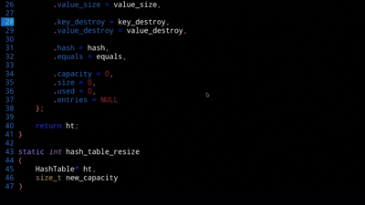
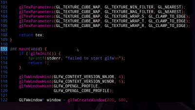
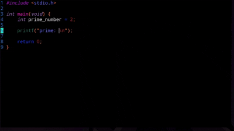
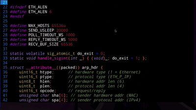
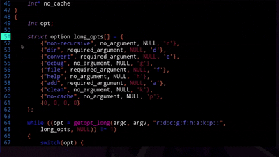

# nytor

**A terminal-based text editor written in C designed for programming.**



`nytor` is a terminal-based text editor focused on being fast, lightweight, 
minimal and somehow extensible, while providing a modern editing experience for 
linux only (for now).

The idea behind it was to create a terminal-based editor like vim or hex
but one that includes some of extra features, such as those found in editors
like subl; and above all, be an editor I would use on a daily basis.


## Features

### Syntax highlighting

Syntax highlighting is provided through plugins, allowing different languages to have their own syntax rules.



Currently supported:

* C
* bash
* Make
* Gdscript (early dev)

### Autocomplete

The editor provides word completion based on the contents of the current file.

The use of the autocomplete is optional and is disabled by default,
but you can enable it using the config file.



### Unicode support

Text is internally represented using Unicode code points, allowing the program to work with UTF-8 text naturally.

### Multiple files

Open and switch between multiple files without leaving the editor.



### Search and replace

replace occurrences individually or throughout the entire file.



### Plugins

Syntax highlighting and other functionality can be extended through plugins.

```text
plugins/
├── c/
├── rust/
└── ...
```

### Prompt command

In order to extend some of the keybind functionalities, there is a prompt
where you can enter specific commands.

You can open it by pressing Ctrl + N. Try tipping the `help` command.

### Other features

In addition to those presented above, the editor has several other features, such as:

- interactive window (Ctrl + Q to close it)
- goto (Ctrl + G or `goto` cmd)
- find a pattern (Ctrl + F or `find`/`match` cmds)
- create/rename a file (Ctrl + T or `new`/`saveas`/`open` cmds)
- call a shell command (`system` cmd)
- create a new (slave) shell section (Ctrl + N or `terminal` cmd)
- force synchronization (`sync` cmd)
- move the cursor to the beginning/end of the line (Ctrl + D or Alt + D)
- move selected lines up/down (Ctrl + Shift + Up/Down)
- undo/redo (Ctrl + Z/Y or `undo`/`redo` cmds)
- auto indentation (plugin only)
- auto comment a line/selection (Ctrl + K or `comment` cmd, plugin only)
- indent/unindent a line/selection (Ctrl + P/O or `indent`/`unindent` cmds)
- set/unset a file as readonly (`set` cmd)
- render a visual representation of spaces and tabs (Alt + T or `show` cmd)
- inotify handler
- (...)

### Possible future features

- Minimal integration with compilers
- Hexadecimal mode
- `comment` cmd start operating on block comments as well
- The `find` functions accept regular expressions
- goto-definition operations etc (see [gotod](scripts/gotod.sh))

## Installation

### Dependencies

On Debian-based systems:

```bash
sudo apt install gcc make
```

In order to use your system's clipboard, you'll need:

#### Wayland:

```bash
sudo apt install wl-clipboard
```

#### X11:

```bash
sudo apt install xclip
```

or

```bash
sudo apt install xsel
```

None of this is really necessary, as the editor has an internal clipboard, but it's required if you want to copy text from within the editor directly to your system clipboard and vice versa.

### Building

Clone the repository and build:

```bash
git clone <repository>
cd nytor

make
```

Then run:

```bash
./nyt file.txt
```

or


```bash
./nyt -h
```

You can exit the program by pressing Ctrl + Q

### Installing

You can automatically install the program with a default
configuration, themes and plugins:

```bash
make
sudo make install
```

There is also a .deb package that installs the program (check Releases section).

## Default config file, themes and plugins

When using `make install` to install the program, the default
configuration files will be located in `/usr/local/share/nytor/`.
If installed via the .deb package, they will be in
`/usr/share/nytor/`. In either case, consider moving this folder
to `~/.config/`, which is entirely optional (though, `~/.config/`
is the first location checked for configuration files and is, by
design, the standard place for them. Since it's optional, the
program will still be able to find the default settings if you
decide not to move the installed folder to `~/.config`).

### Uninstalling

In order to uninstall the program:

```bash
sudo make uninstall
```

## Usage

```bash
nyt [ARGS] [FILE...]
```

If no file is provided, the program starts with an empty buffer.

## Manual

See how to use the editor, change settings, create themes and more on the man page:

```bash
man manual/nyt.1
```

or

```bash
man nyt
```

## Configuration

Configuration files are stored in:

```text
~/.config/nytor/
```

## Limitations

There is no hex mode.

There is no tilde expansion.

The program currently doesn't handle huge files very well: that is,
it will use a lot of memory if that happens.

To avoid headaches early in the project, I stored Unicode characters
as fixed 4-byte values. The problem with this is that if the editor is
actually used for programming, it's almost impossible to find a non-ASCII
character, meaning some memory would be wasted.
I don't necessarily think it's a problem, but i do plan to change the
storage strategy someday (and consequently, the strategy for access,
removal, inserting, (..........................................)

The autocomplete algorithm has complexity O(`size of file`).

## Project status

Given the program's simple nature and my goal of creating an editor that is basic yet good enough for my daily use, the `nyt` is technically completely finished, meaning no major changes or features are likely to be added. Future updates will consist mainly of bug fixes, improvements to existing plugins, the addition of new plugins, and possibly some internal optimizations (courageously handling UTF-8 or huge files, for example) that i plan to tackle... who knows when, just for fun (because i don't really think they are needed).

## Contributing

Contributions, bug reports and suggestions are welcome.

Before reporting a bug, check if it has already been discovered
in [`changelog.txt`](./changelog.txt).

## License

This project is licensed under the GNU General Public License v3.0.
See the [LICENSE](LICENSE) file for details.